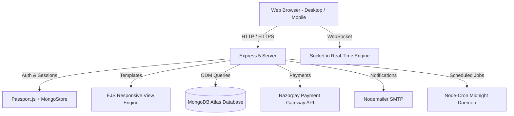

# ⚡ FreelanceHub — Full-Stack Freelance Marketplace Platform

<div align="center">


[](https://nodejs.org/)
[](https://expressjs.com/)
[](https://www.mongodb.com/)
[](https://socket.io/)
[](https://razorpay.com/)
[](LICENSE)

**A high-performance, full-stack marketplace connecting visionary clients with world-class freelancers.**  
Featuring escrow payments, real-time messaging, automated milestone reporting, role-based dashboards, and complete administrative control.

[Key Features](#-key-features) • [Quick Start](#-quick-start) • [Default Credentials](#-default-test-credentials) • [Architecture](#-architecture) • [Deployment](#-deployment)

</div>

---

## 🌟 Key Features

### 👨‍💼 1. Client Hub
- **Post & Manage Projects**: Specify custom requirements, timelines, fixed budgets, and deliverable skills.
- **Review Proposals & Hire Talent**: Browse incoming bids, compare freelancer profiles, ratings, and hire seamlessly.
- **Milestone & Escrow Funding**: Fund projects securely via **Razorpay** checkout with automatic payment confirmation.
- **Real-Time Collaboration**: Chat directly with hired talent through socket-driven instant messaging.
- **Daily Progress Tracking**: Monitor freelancer daily submissions, task checklists, and completion rates.

### 💻 2. Freelancer Workspace
- **Discover Projects**: Search and filter opportunities by skill, category, budget range, and popularity.
- **Custom Proposals**: Submit detailed bids with delivery timelines and custom pitch letters.
- **Portfolio & Profile Customizer**: Highlight hourly rates, skills, past projects, availability status, and bios.
- **Daily Progress Reports**: Submit end-of-day reports with accomplishments, roadblocks, and percentage progress.
- **Earnings & Payouts Dashboard**: Track completed projects, pending payments, and overall revenues.

### 🛡️ 3. Super Admin Control Center
- **Dedicated Admin Portal**: Separate authentication gateway (`/auth/admin/login`) with secret key protection.
- **User Management**: Inspect, verify, suspend, or ban client and freelancer accounts.
- **Project Oversight**: Monitor active, completed, or disputed projects across the platform.
- **Financial Analytics**: Real-time revenue insights, total platform volume, and Razorpay transaction logs.
- **Automated Verification Daemon**: Automated background cron tasks warning unverified signups and handling auto-bans.

### 🎨 4. Design & Experience
- **Sleek Light & Dark Theme**: Integrated theme switcher with persistent local storage state.
- **Fully Responsive**: Off-canvas mobile navigation drawer, fluid grid layouts, and touch-friendly controls.
- **Live Notifications**: Dropdown badge notifications powered by Socket.io and database persistence.
- **Robust Security**: bcrypt password hashing, session management via MongoDB store, CSRF & flash feedback alerts.

---

## 🔑 Account Roles & User Access

The platform provides dedicated workflows and dashboards for each user type:

### 👨‍💼 Client Account
- **Registration**: Sign up at [/auth/register](http://localhost:3000/auth/register) and select the **Client** account type.
- **Capabilities**: Post projects, browse and hire vetted talent, fund milestones via Razorpay escrow, review daily progress reports, and rate completed projects.

### 💻 Freelancer Account
- **Registration**: Sign up at [/auth/register](http://localhost:3000/auth/register) and select the **Freelancer** account type.
- **Capabilities**: Browse open marketplace jobs, submit proposals and bids, message clients in real-time, submit daily report progress, and receive milestone payouts.

### 🛡️ Administrator Portal
- **Access**: Secure admin portal with two-factor security PIN authorization.
- **Capabilities**: Platform-wide metrics, user directory moderation, project tracking, escrow management, and admin access approvals.

---

## 🏗️ Architecture & Technology Stack



| Layer | Technologies |
| :--- | :--- |
| **Backend Runtime** | Node.js (v18+ / v20+), Express.js 5 |
| **Database** | MongoDB Atlas with Mongoose ODM |
| **Real-Time Layer** | Socket.io (instant messaging & notification pings) |
| **Templating** | EJS (Embedded JavaScript) with partials |
| **Styling** | Vanilla CSS3, Custom Design System, FontAwesome 6, Chart.js 4 |
| **Authentication** | Passport.js (Local Strategy & Google OAuth 2.0), bcryptjs |
| **Payments** | Razorpay (Escrow funding, test mode & webhook handling) |
| **Email & Cron** | Nodemailer (Gmail SMTP), Node-Cron (verification & cleanup) |

---

## 📁 Repository File Structure

```
freelance-app/
├── config/
│   ├── db.js                 # MongoDB connection & DNS resolver setup
│   ├── passport.js           # Passport authentication strategies
│   └── socket.io.js          # Socket.io connection & chat room handlers
├── controllers/
│   ├── adminController.js     # Admin metrics, user moderation & settings
│   ├── authController.js      # User & admin registration, login & OTP logic
│   ├── clientController.js    # Client project posting & proposal management
│   ├── freelancerController.js# Job search, proposal bidding & daily reporting
│   ├── messageController.js   # Chat history & conversation threads
│   ├── paymentController.js   # Razorpay checkout & payment verification
│   ├── projectController.js   # Shared project view routing
│   └── reportController.js    # Daily work report queries
├── models/
│   ├── Conversation.js        # Message threads model
│   ├── Message.js             # Real-time messages schema
│   ├── Notification.js        # User notifications schema
│   ├── Payment.js             # Escrow payments & ledger schema
│   ├── Project.js             # Client projects schema
│   ├── Proposal.js            # Freelancer bids schema
│   ├── Report.js              # Daily work reports schema
│   └── User.js                # Core user profile & credential model
├── public/
│   ├── css/
│   │   ├── auth.css          # Auth forms & registration styling
│   │   ├── chat.css          # Real-time chat layout & message bubbles
│   │   ├── dashboard.css     # Analytics cards, charts & stats
│   │   ├── main.css          # Core design system & responsive navigation
│   │   └── theme.css         # Dynamic Dark & Light theme engine
│   ├── js/
│   │   ├── charts.js         # Chart.js analytics visualizations
│   │   ├── chat.js           # Client-side socket chat integration
│   │   ├── main.js           # Sidebar toggle & menu interactions
│   │   ├── notifications.js  # Live notification popover
│   │   └── theme.js          # Theme switcher & local storage persistence
├── routes/                   # Modular Express route handlers
├── views/
│   ├── admin/                # Admin dashboards, user tables, login & register
│   ├── auth/                 # User login, registration, OTP & password reset
│   ├── client/               # Client project creator, proposal inspector
│   ├── freelancer/           # Job board, proposal manager, daily report form
│   ├── layouts/              # Master layouts
│   ├── partials/             # Navbar, sidebar, flash banners, notification bell
│   ├── payment/              # Razorpay checkout & receipts
│   └── shared/               # Chat room, profile, 404, 500 & project details
├── .env.example              # Environment variables template
├── createAdmin.js            # Standalone admin creation CLI script
├── resetPasswords.js         # All-user credentials reset utility
├── server.js                 # Primary server entrypoint
└── package.json              # Project dependencies & scripts
```

---

## 🚀 Quick Start & Installation

### 1. Prerequisites
- **Node.js** v18.0 or higher
- **npm** v9.0 or higher
- **MongoDB Atlas** database URI or local MongoDB instance

### 2. Clone the Repository
```bash
git clone https://github.com/Rajkumar1813/freelancer-app.git
cd freelancer-app
```

### 3. Install Dependencies
```bash
npm install
```

### 4. Configure Environment Variables
Copy `.env.example` to create your own `.env` file:
```bash
cp .env.example .env
```
Fill in your configuration details:
```env
PORT=3000
MONGODB_URI=your_mongodb_connection_string
JWT_SECRET=your_jwt_secret_key
SESSION_SECRET=your_session_secret_key

# Google OAuth (Optional for local dev)
GOOGLE_CLIENT_ID=your_google_client_id
GOOGLE_CLIENT_SECRET=your_google_client_secret
GOOGLE_CALLBACK_URL=http://localhost:3000/auth/google/callback

# SMTP Email (Gmail App Password)
EMAIL_HOST=smtp.gmail.com
EMAIL_PORT=587
EMAIL_USER=your_email@gmail.com
EMAIL_PASS=your_gmail_app_password

# Admin Access Secret
ADMIN_SECRET_KEY=your_secret_admin_key

# Razorpay Payment Gateway (Test Mode)
RAZORPAY_MODE=test
RAZORPAY_TEST_KEY_ID=rzp_test_xxxxxx
RAZORPAY_TEST_KEY_SECRET=xxxxxx
```

### 5. Launch the Application
```bash
# Start server
npm start
```
Open your browser and navigate to:
```
http://localhost:3000
```

---

## 🔄 Useful Scripts

| Command | Description |
| :--- | :--- |
| `npm start` | Boots the application on the designated port (default: 3000). |
| `node createAdmin.js` | Initializes or promotes an existing account to Super Admin. |
| `node resetPasswords.js` | Utility to reset development account credentials. |

---

## 🌐 API & Main Route Endpoints

| Route | Role / Scope | Description |
| :--- | :--- | :--- |
| `/auth/login` | Public | Client and Freelancer authentication |
| `/auth/register` | Public | Client and Freelancer account creation |
| `/client/dashboard` | Client | Active projects, total spent & incoming proposals |
| `/client/post-project` | Client | Create new project with deliverables and budget |
| `/freelancer/dashboard` | Freelancer | Proposals overview, active jobs & daily earnings |
| `/freelancer/browse-projects` | Freelancer | Filter and submit bids on open projects |
| `/messages` | Authenticated | Real-time chat threads between clients & freelancers |
| `/payments/checkout/:id` | Client | Razorpay payment flow to fund project escrow |
| `/admin/dashboard` | Admin | Overall platform statistics and metrics |
| `/admin/users` | Admin | Comprehensive user directory and moderation controls |

---

## 🚢 Deployment

The platform is ready for 1-click deployment on **Render.com**, **Railway**, or any standard Node.js hosting platform:
- `render.yaml` configuration is included out of the box.
- Remember to configure `trust proxy` (already enabled in `server.js`).
- Add environment variables in your hosting provider's dashboard.

---

## 📄 License

This project is licensed under the [ISC License](LICENSE).

<div align="center">
  <sub>Built with ❤️ for modern freelancers and clients worldwide.</sub>
</div>
